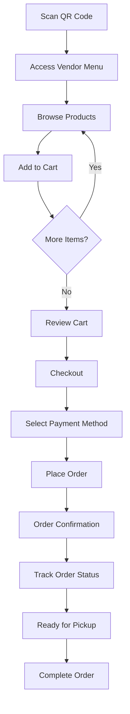

# Customer Frontend File Organization Plan

**Date:** December 27, 2025  
**Purpose:** Complete customer-side frontend file structure and organization

---

## 📋 CUSTOMER FRONTEND ARCHITECTURE

### Core Customer Features
1. **QR Code Access** - Scan QR to access vendor menu
2. **Menu Browsing** - Browse vendor products with categories and search
3. **Cart Management** - Add/remove items, customize with addons
4. **Order Placement** - Checkout process with payment method selection
5. **Order Tracking** - Real-time order status updates
6. **Order History** - View past orders and receipts
7. **Profile Management** - Customer account settings

### Design Philosophy
- **Mobile-First**: Optimized for smartphone restaurant use
- **Touch-Friendly**: Large buttons and touch targets
- **Fast Loading**: Optimized for quick restaurant service
- **Intuitive Navigation**: Minimal learning curve for customers

---

## 📁 COMPLETE CUSTOMER FILE STRUCTURE

### Layout Directory
```
resources/js/pages/customer/
└── layout/
    └── CustomerLayout.vue (CREATE - Mobile-first responsive layout)
```

### Menu & Vendor Browsing Module
```
resources/js/pages/customer/menu/
├── Index.vue (Vendor selection/browse available restaurants)
├── VendorMenu.vue (Individual vendor menu display)
├── ProductDetails.vue (Product detail modal/sheet)
├── components/
│   ├── VendorCard.vue (Vendor display card)
│   ├── ProductCard.vue (Product display with pricing)
│   ├── CategoryFilter.vue (Product category tabs)
│   ├── SearchBar.vue (Product search functionality)
│   ├── VendorHero.vue (Vendor info header)
│   ├── ProductQuickAdd.vue (Quick add to cart button)
│   └── EmptyMenu.vue (No products available state)
├── composables/
│   ├── useVendors.ts (Available vendors data)
│   ├── useMenu.ts (Menu browsing functionality)
│   └── useProductSearch.ts (Product search logic)
└── types/
    └── menu.ts (Menu-related TypeScript types)
```

### Cart Management Module
```
resources/js/pages/customer/cart/
├── Index.vue (Cart review and modification)
├── components/
│   ├── CartItem.vue (Individual cart item display)
│   ├── CartSummary.vue (Total price calculation)
│   ├── AddonSelector.vue (Product addon selection)
│   ├── QuantitySelector.vue (Item quantity controls)
│   ├── CartEmpty.vue (Empty cart state)
│   └── CartHeader.vue (Cart page header)
├── store/
│   └── cart.ts (Pinia cart state management)
└── composables/
    ├── useCart.ts (Cart operations)
    ├── useCartTotals.ts (Price calculations)
    └── useCartPersistence.ts (Local storage cart)
```

### Order Management Module
```
resources/js/pages/customer/orders/
├── Checkout.vue (Order placement and payment)
├── Tracking.vue (Real-time order status)
├── History.vue (Order history and receipts)
├── Receipt.vue (Order receipt display)
├── components/
│   ├── OrderCard.vue (Order display card)
│   ├── OrderStatus.vue (Status timeline/progress)
│   ├── PaymentMethod.vue (Payment options)
│   ├── OrderSummary.vue (Order details summary)
│   ├── OrderItem.vue (Individual order item)
│   ├── OrderTimer.vue (Preparation time countdown)
│   └── ReceiptPreview.vue (Receipt preview)
├── composables/
│   ├── useOrders.ts (Order management)
│   ├── useOrderTracking.ts (Real-time tracking)
│   ├── useOrderHistory.ts (Order history data)
│   └── usePayment.ts (Payment processing)
└── types/
    └── orders.ts (Order-related types)
```

### Profile & Account Module
```
resources/js/pages/customer/profile/
├── Index.vue (Customer profile view)
├── Edit.vue (Profile editing form)
├── components/
│   ├── ProfileForm.vue (Profile editing form)
│   ├── AvatarUpload.vue (Profile picture upload)
│   └── Preferences.vue (Customer preferences)
└── composables/
    └── useCustomerProfile.ts (Profile management)
```

### Authentication Module
```
resources/js/pages/customer/auth/
├── Login.vue (⚠️ EXISTING - needs mobile optimization)
├── Register.vue (⚠️ EXISTING - needs mobile optimization)
└── components/
    └── AuthForm.vue (Reusable auth form wrapper)
```

---

## 📱 CUSTOMER LAYOUT STRUCTURE

### CustomerLayout.vue Requirements
```
resources/js/layouts/customer/CustomerLayout.vue
├── Header (Mobile-optimized)
│   ├── Back Button (contextual navigation)
│   ├── Page Title
│   ├── Cart Icon (with item count badge)
│   └── Profile Menu (if logged in)
├── Main Content Area
│   └── Page content slot
└── Bottom Navigation (Mobile-first)
    ├── Menu/Home
    ├── Cart
    ├── Orders
    └── Profile
```

### Mobile-First Design Features
- **Touch Targets**: Minimum 44px touch targets
- **Swipe Gestures**: Swipe between categories, cart actions
- **Responsive Images**: Optimized product images
- **Fast Loading**: Progressive image loading
- **Offline Support**: Basic offline cart functionality

---

## 🛒 CART MANAGEMENT STRATEGY

### Cart State Management (Pinia Store)
```typescript
// store/cart.ts
export const useCartStore = defineStore('cart', () => {
  const items = ref<CartItem[]>([])
  const vendor = ref<Vendor | null>(null)
  
  const addItem = (product: Product, quantity: number, addons: Addon[]) => { }
  const removeItem = (itemId: string) => { }
  const updateQuantity = (itemId: string, quantity: number) => { }
  const clearCart = () => { }
  const totalPrice = computed(() => { })
  const totalItems = computed(() => { })
})
```

### Cart Persistence
- **Local Storage**: Maintain cart across sessions
- **Vendor Isolation**: Clear cart when switching vendors
- **Addon Management**: Handle product customizations
- **Price Calculations**: Include addon pricing

---

## 📋 ORDER FLOW IMPLEMENTATION

### Complete Customer Journey


### Order Status Tracking
1. **Order Placed** - "Your order has been submitted"
2. **Vendor Accepted** - "Restaurant accepted your order"
3. **Preparing** - "Your order is being prepared"
4. **Ready** - "Your order is ready for pickup"
5. **Completed** - "Order completed - thank you!"

---

## 🎨 MOBILE-FIRST DESIGN SYSTEM

### Tailwind CSS Mobile-First Classes
```css
/* Mobile-first responsive design */
.customer-container { @apply max-w-sm mx-auto bg-white min-h-screen; }
.customer-header { @apply sticky top-0 bg-white border-b border-gray-200 p-4 z-10; }
.customer-content { @apply p-4 pb-20; } /* Bottom padding for nav */
.customer-card { @apply bg-white rounded-lg shadow-sm border border-gray-200 p-4 mb-4; }
.customer-button { @apply w-full py-3 bg-orange-500 text-white rounded-lg font-medium; }
.customer-button-secondary { @apply w-full py-3 bg-gray-100 text-gray-700 rounded-lg font-medium; }

/* Touch-friendly sizing */
.touch-target { @apply min-h-11 min-w-11; } /* 44px minimum */
.product-image { @apply w-full h-32 object-cover rounded-lg; }
.cart-item { @apply flex items-center gap-3 p-3 bg-gray-50 rounded-lg; }

/* Status indicators */
.status-pending { @apply bg-yellow-100 text-yellow-800 px-2 py-1 rounded-full text-sm; }
.status-accepted { @apply bg-blue-100 text-blue-800 px-2 py-1 rounded-full text-sm; }
.status-ready { @apply bg-green-100 text-green-800 px-2 py-1 rounded-full text-sm; }
```

### Color Scheme
- **Primary**: Orange (#F97316) - App brand color
- **Secondary**: Gray (#6B7280) - Supporting elements
- **Success**: Green (#10B981) - Completed states
- **Warning**: Yellow (#F59E0B) - Pending states
- **Error**: Red (#EF4444) - Error states

---

## 🔄 REAL-TIME FEATURES

### WebSocket Integration for Order Tracking
```typescript
// composables/useOrderTracking.ts
export const useOrderTracking = (orderId: string) => {
  const orderStatus = ref<OrderStatus>('pending')
  const estimatedTime = ref<number>(0)
  
  // WebSocket connection for real-time updates
  // Order status changes
  // Preparation time updates
}
```

### Push Notifications
- **Order Status Updates**: Real-time status changes
- **Ready for Pickup**: Push notification when order is ready
- **Order Confirmation**: Initial order confirmation

---

## 📡 API INTEGRATION PATTERNS

### Customer API Client
```typescript
// api/customer-client.ts
const customerClient = axios.create({
  baseURL: '/api/customer',
  headers: {
    'Authorization': `Bearer ${localStorage.getItem('token')}`,
    'Content-Type': 'application/json'
  }
});

// Customer service modules
export const menuService = {
  getVendors: () => customerClient.get('/vendors'),
  getVendorMenu: (vendorId) => customerClient.get(`/vendors/${vendorId}`),
  searchProducts: (query) => customerClient.get('/products/search', { params: { query } })
};

export const cartService = {
  getCart: () => customerClient.get('/cart'),
  addToCart: (data) => customerClient.post('/cart', data),
  updateCartItem: (itemId, data) => customerClient.put(`/cart/${itemId}`, data),
  removeFromCart: (itemId) => customerClient.delete(`/cart/${itemId}`),
  clearCart: (vendorId) => customerClient.delete(`/cart/clear/${vendorId}`)
};

export const orderService = {
  placeOrder: (data) => customerClient.post('/orders', data),
  getOrders: () => customerClient.get('/orders'),
  getOrderHistory: () => customerClient.get('/orders/history'),
  trackOrder: (orderId) => customerClient.get(`/orders/${orderId}/track`),
  cancelOrder: (orderId) => customerClient.post(`/orders/${orderId}/cancel`)
};
```

---

## 🔧 MISSING CUSTOMER FEATURES

### Critical Missing Components
1. **QR Code Scanner** - Camera integration for QR code scanning
2. **Vendor Selection** - Browse available restaurants
3. **Menu Browsing** - Product catalog with categories
4. **Cart Management** - Full shopping cart functionality
5. **Order Placement** - Checkout process
6. **Order Tracking** - Real-time status updates
7. **Payment Integration** - Payment method selection
8. **Order History** - Past orders and receipts

### Advanced Features
1. **Favorites** - Save favorite products/vendors
2. **Ratings & Reviews** - Product and vendor ratings
3. **Special Instructions** - Order customization notes
4. **Delivery Options** - Pickup vs delivery (future)
5. **Loyalty Program** - Points and rewards (future)

---

## 📊 DEVELOPMENT ESTIMATION

| Feature Category | Estimated Files | Development Time |
|------------------|-----------------|------------------|
| Layout & Navigation | 3 files | 1 day |
| Menu & Vendor Browsing | 12 files | 3-4 days |
| Cart Management | 8 files | 2-3 days |
| Order Management | 15 files | 4-5 days |
| Profile & Auth | 6 files | 1-2 days |
| Components & Composables | 20 files | 3-4 days |
| **Total** | **~64 files** | **14-19 days** |

---

## 🎯 IMPLEMENTATION PHASES

### Phase 1: Core Customer Experience (Week 1-2)
1. Create CustomerLayout with mobile-first design
2. Implement QR code access flow
3. Build vendor menu browsing
4. Basic cart functionality

### Phase 2: Order Management (Week 2-3)
1. Complete cart management with persistence
2. Order placement and checkout
3. Payment method selection
4. Order confirmation flow

### Phase 3: Real-time Features (Week 3-4)
1. Order tracking with WebSocket
2. Real-time status updates
3. Push notifications
4. Order history

### Phase 4: Enhancement & Polish (Week 4-5)
1. Profile management
2. Advanced cart features
3. Performance optimization
4. Mobile responsiveness testing

---

## 🔍 CUSTOMER UX CONSIDERATIONS

### Mobile Restaurant Environment
- **Quick Service**: Fast ordering for busy restaurants
- **Touch-Friendly**: Large buttons and easy navigation
- **Clear Pricing**: Transparent cost calculation
- **Order Tracking**: Clear status communication
- **Error Handling**: Graceful error messages and recovery

### Accessibility
- **Screen Reader Support**: Proper ARIA labels
- **High Contrast**: Readable color combinations
- **Large Text**: Scalable typography
- **Keyboard Navigation**: Full keyboard accessibility

### Performance
- **Fast Loading**: Optimized for mobile networks
- **Offline Support**: Basic cart functionality offline
- **Image Optimization**: Compressed product images
- **Lazy Loading**: Progressive content loading

---

## 📱 CROSS-PLATFORM CONSIDERATIONS

### Progressive Web App (PWA)
- **Add to Home Screen**: Install prompt for repeat customers
- **Offline Functionality**: Basic cart and menu browsing offline
- **Push Notifications**: Order status updates
- **Background Sync**: Sync orders when connection returns

### Browser Compatibility
- **Modern Mobile Browsers**: Chrome, Safari, Firefox
- **Progressive Enhancement**: Graceful degradation for older browsers
- **Touch Events**: Proper touch gesture handling

This customer frontend organization plan provides a comprehensive structure for building a mobile-first, customer-friendly ordering interface for the QR code restaurant system.
