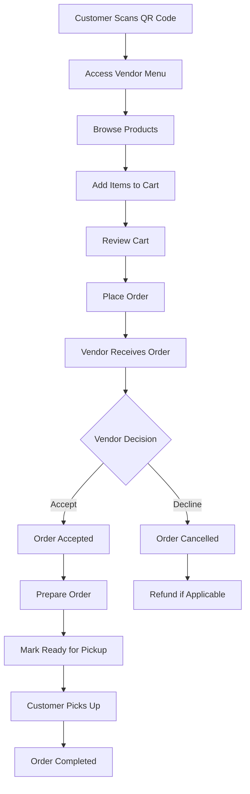

# Transaction Flow & Frontend Organization Analysis

**Date:** December 27, 2025  
**System:** QR Code Restaurant Ordering System

---

## 🔄 TRANSACTION FLOW ANALYSIS

### Core Business Logic
This is a **QR Code-based restaurant ordering system** where:
- Vendors set up digital menus with QR codes
- Customers scan QR codes to access vendor menus
- Customers place orders through the digital interface
- Vendors manage orders and operations

### Complete Transaction Flow



### Database Entity Relationships

#### Core Models:
1. **User** - Base user with role (customer/vendor/superadmin)
2. **Vendor** - Restaurant/brand with QR codes
3. **Product** - Menu items sold by vendors
4. **Order** - Customer purchases
5. **OrderItem** - Individual products in orders
6. **Cart/CartItem** - Customer shopping cart
7. **Addon** - Product customization options
8. **Notification** - System notifications

#### Key Relationships:
```
User (customer) → Cart → CartItems → Product
User (customer) → Orders → OrderItems → Product
Vendor → Products
Vendor → Orders (received orders)
Product → Addons
```

### Order Status Lifecycle
1. **pending** - Order placed, waiting for vendor response
2. **accepted** - Vendor accepted, preparing order
3. **ready_for_pickup** - Order ready for customer pickup (completion state)
4. **cancelled** - Order declined by vendor

---

## 🗃️ BACKEND API STRUCTURE ANALYSIS

### Vendor API Routes (`/api/vendor/*`)
```
✅ Analytics
  ├── GET /analytics/sales
  ├── GET /analytics/best-sellers
  ├── GET /analytics/order-metrics
  ├── GET /analytics/revenue
  └── GET /analytics/profit

✅ Orders Management
  ├── GET /orders (list)
  ├── GET /orders/stats (dashboard stats)
  ├── GET /orders/{id} (details)
  ├── PATCH /orders/{id}/accept
  ├── PATCH /orders/{id}/decline
  ├── PATCH /orders/{id}/ready
  └── DELETE /orders/batch

✅ Products
  ├── GET /products (with categories, filters)
  ├── POST /products
  ├── GET /products/{id}
  ├── PUT /products/{id}
  ├── DELETE /products/{id}
  └── PATCH /products/{id}/toggle-status

✅ Addons
  ├── GET /products/{product}/addons
  ├── POST /products/{product}/addons
  ├── GET /addons/{addon}
  ├── PUT /addons/{addon}
  ├── DELETE /addons/{addon}
  └── PATCH /addons/{addon}/toggle

✅ QR Code Management
  ├── GET /qr (show current)
  ├── POST /qr (upload new)
  ├── PUT /qr (update)
  ├── GET /qr/preview
  └── GET /qr/public-url

✅ Notifications
  ├── GET /notifications
  ├── POST /notifications/mark-all-read
  └── DELETE /notifications/{id}
```

### Customer API Routes (`/api/customer/*`)
```
✅ Menu & Vendors
  ├── GET /vendors (list available vendors)
  ├── GET /vendors/{vendor} (vendor menu)
  ├── GET /vendors/{vendor}/qr-payment
  ├── GET /products/search
  ├── GET /products/{id}
  └── GET /categories

✅ Cart Management
  ├── GET /cart
  ├── POST /cart
  ├── PUT /cart/{item}
  ├── DELETE /cart/{item}
  └── DELETE /cart/clear/{vendor}

✅ Orders
  ├── GET /orders
  ├── GET /orders/history
  ├── POST /orders
  ├── GET /orders/{id}
  ├── GET /orders/{id}/track
  ├── GET /orders/{id}/receipt
  └── POST /orders/{id}/cancel

✅ Notifications
  ├── GET /notifications
  └── POST /notifications/mark-all-read
```

---

## 📁 CURRENT FRONTEND FILE ORGANIZATION

### Existing Structure
```
resources/js/
├── pages/
│   ├── auth/ (✅ Complete - Login, Register, etc.)
│   ├── superadmin/ (✅ Complete - Dashboard, Vendors management)
│   └── vendor/ (⚠️ Partial - Some pages exist, layout issues)
│       ├── Dashboard.vue (⚠️ Missing VendorLayout wrapper)
│       ├── Products.vue (✅ Complete with full functionality)
│       ├── Analytics.vue (✅ Complete)
│       ├── OrderHistory.vue (⚠️ Missing VendorLayout wrapper)
│       └── QrCode.vue (✅ Complete)
└── layouts/
    ├── auth/ (✅ Complete)
    └── vendor/
        └── VendorLayout.vue (✅ Exists)
```

### Issues Identified
1. **Layout Inconsistency**: OrderHistory.vue and Dashboard.vue missing VendorLayout wrapper
2. **Missing Customer Pages**: No customer-facing pages in the structure
3. **Incomplete Vendor Flow**: Vendor pages exist but some functionality gaps

---

## 🎯 VENDOR FRONTEND ORGANIZATION PLAN

### Recommended File Structure
```
resources/js/pages/vendor/
├── layout/
│   └── VendorLayout.vue (✅ Exists - needs wrapper fixes)
├── dashboard/
│   └── Dashboard.vue (Fix: Add VendorLayout wrapper)
├── orders/
│   ├── Index.vue (Incoming orders management)
│   ├── History.vue (Order history - Fix: Add VendorLayout wrapper)
│   ├── Details.vue (Individual order details modal/page)
│   └── components/
│       ├── OrderCard.vue
│       ├── OrderActions.vue
│       └── OrderStatusBadge.vue
├── products/
│   ├── Index.vue (✅ Complete)
│   ├── Create.vue (Product creation form)
│   ├── Edit.vue (Product editing form)
│   └── components/
│       ├── ProductCard.vue
│       ├── ProductForm.vue
│       ├── ProductFilters.vue
│       └── AddonManager.vue
├── analytics/
│   ├── Index.vue (✅ Complete)
│   └── components/
│       ├── SalesChart.vue
│       ├── OrderMetrics.vue
│       ├── RevenueBreakdown.vue
│       └── BestSellers.vue
├── qr-code/
│   ├── Index.vue (✅ Complete)
│   └── components/
│       ├── QrPreview.vue
│       └── QrUpload.vue
├── notifications/
│   ├── Index.vue (Notifications list)
│   └── components/
│       └── NotificationCard.vue
└── settings/
    ├── Profile.vue (Vendor profile management)
    └── Account.vue (Account settings)
```

### Key Features for Vendor Frontend:
1. **Dashboard**: Real-time order stats, quick actions
2. **Order Management**: Accept/decline orders, mark ready, view history
3. **Product Management**: CRUD operations, category management, stock tracking
4. **Analytics**: Sales metrics, order trends, profit analysis
5. **QR Code**: Generate, upload, manage QR codes
6. **Notifications**: Order alerts, system notifications

---

## 🎯 CUSTOMER FRONTEND ORGANIZATION PLAN

### Recommended File Structure
```
resources/js/pages/customer/
├── layout/
│   └── CustomerLayout.vue (Create - mobile-first design)
├── menu/
│   ├── Index.vue (Vendor selection/browse)
│   ├── VendorMenu.vue (Individual vendor menu)
│   ├── ProductDetails.vue (Product detail modal)
│   └── components/
│       ├── VendorCard.vue
│       ├── ProductCard.vue
│       ├── CategoryFilter.vue
│       └── SearchBar.vue
├── cart/
│   ├── Index.vue (Cart review)
│   ├── components/
│   │   ├── CartItem.vue
│   │   ├── CartSummary.vue
│   │   └── AddonSelector.vue
│   └── store.ts (Cart state management)
├── orders/
│   ├── Checkout.vue (Order placement)
│   ├── Tracking.vue (Order status tracking)
│   ├── History.vue (Order history)
│   ├── Receipt.vue (Order receipt)
│   └── components/
│       ├── OrderCard.vue
│       ├── OrderStatus.vue
│       └── PaymentMethod.vue
├── profile/
│   ├── Index.vue (Customer profile)
│   └── components/
│       └── ProfileForm.vue
└── auth/
    ├── Login.vue (✅ Exists in auth/)
    └── Register.vue (✅ Exists in auth/)
```

### Key Features for Customer Frontend:
1. **QR Code Access**: Scan QR to access vendor menu
2. **Menu Browsing**: Product catalog with categories, search, filters
3. **Cart Management**: Add/remove items, customize with addons
4. **Order Placement**: Checkout process, payment method selection
5. **Order Tracking**: Real-time order status updates
6. **Order History**: Past orders, receipts, reorder functionality
7. **Mobile-First Design**: Optimized for mobile restaurant environment

---

## 🔧 IMMEDIATE FIXES NEEDED

### 1. Layout Wrapper Fixes
**Issue**: Vendor pages missing VendorLayout wrapper
**Files to Fix**:
- `resources/js/pages/vendor/Dashboard.vue`
- `resources/js/pages/vendor/OrderHistory.vue`

**Solution**: Add VendorLayout wrapper as seen in other vendor pages

### 2. Missing Customer Pages
**Critical Gap**: No customer-facing pages exist
**Priority Pages to Create**:
1. Customer layout and routing
2. Menu browsing and vendor selection
3. Cart management system
4. Order placement and tracking
5. Customer order history

### 3. API Integration Verification
**Ensure all API endpoints work with frontend**:
- Verify authentication token handling
- Test all CRUD operations
- Validate real-time order updates
- Check mobile responsiveness

---

## 📊 FRONTEND FILE COUNT COMPARISON

| Component | Current | Planned | Gap |
|-----------|---------|---------|-----|
| Vendor Pages | 5 | 12 | +7 |
| Customer Pages | 0 | 15 | +15 |
| Shared Components | Limited | 25+ | +25 |
| Layouts | 2 | 3 | +1 |

**Total Frontend Development Needed**: ~50 new files/components

---

## 🎯 IMPLEMENTATION PRIORITY

### Phase 1: Critical Fixes (Week 1)
1. Fix VendorLayout wrapper issues
2. Create basic customer authentication flow
3. Implement vendor menu browsing

### Phase 2: Core Functionality (Week 2-3)
1. Customer cart management
2. Order placement system
3. Vendor order management improvements

### Phase 3: Advanced Features (Week 4)
1. Real-time notifications
2. Advanced analytics
3. Mobile optimization
4. Order tracking system

---

## 🔍 NOTES

- **No File Editing**: This analysis is for planning purposes only
- **Framework**: Vue.js 3 with Inertia.js
- **Styling**: Tailwind CSS
- **Mobile-First**: Customer interface optimized for mobile restaurant use
- **Real-Time**: Order status updates require WebSocket integration

This analysis provides the foundation for implementing a complete vendor and customer frontend experience.
